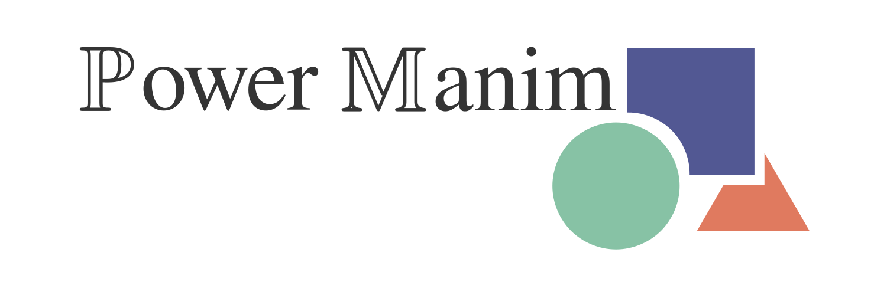

[](https://lucmos.github.io/powermanim)

<p align="center">
    <a href="https://pypi.org/project/powermanim/"></a>
    <a href="https://pypi.org/project/powermanim/"></a>
    <a href="https://github.com/lucmos/powermanim/actions/workflows/publish.yml"></a>
    <a href="https://lucmos.github.io/powermanim"></a>
    <a href="https://black.readthedocs.io/en/stable/"></a>
</p>

Manim extension with custom components, layouts and slide templates aimed to ease the development of live presentations.


## Installation

```bash
pip install git+ssh://git@github.com/lucmos/powermanim.git
```


## Quickstart

[comment]: <> (> Fill me!)


## Development installation

Setup the development environment:

```bash
git clone git@github.com:lucmos/powermanim.git
cd powermanim
conda env create -f env.yaml
conda activate powermanim
pre-commit install
```

Run the tests:

```bash
pre-commit run --all-files
pytest -v
```


### Update the dependencies

Re-install the project in edit mode:

```bash
pip install -e .[dev]
```
